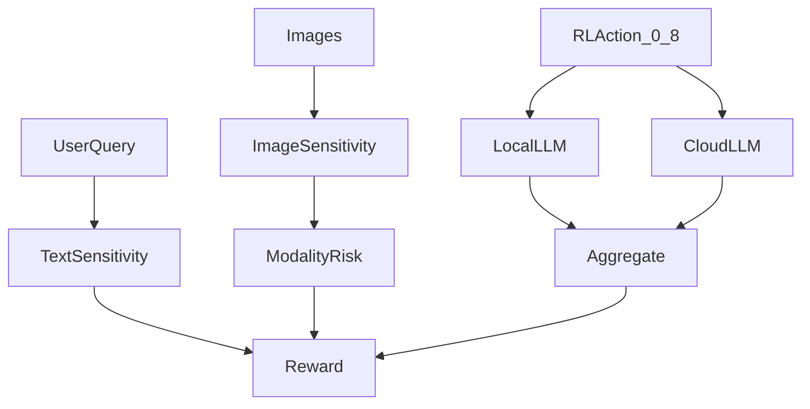

# Privacy-TMO

**Privacy-Preserving Personalized LLM Offloading for Edge-Cloud Collaboration**

[](https://www.python.org/)
[](https://opensource.org/licenses/MIT)

> 기존 [TMO (MobiHoc 2025)](./TMO/README.md) 프레임워크를 확장하여 **프라이버시 보호**, **온디바이스 개인화**, **멀티모달 모달리티 선택**을 통합한 Edge-Cloud LLM 오프로딩 시스템

---

## 개요

Privacy-TMO는 **텍스트 + 이미지 모달리티**가 포함된 멀티모달 질의에서, 품질·지연·비용과 함께 **프라이버시 리스크**까지 최적화하는 오프로딩 프레임워크입니다.  
기존 TMO의 “어떤 모달리티 조합을 클라우드로 보낼 것인가(액션 0–8)”를 유지하면서 **모달리티 민감도**를 보상에 반영합니다.

---

## 핵심 특징

- **On-Device LoRA 개인화**: QLoRA 기반, 개인 데이터는 디바이스 밖으로 나가지 않음
- **민감도 기반 선택적 오프로딩**: 텍스트 민감도 + 쿼리 분해
- **멀티모달 프라이버시 통합**: 이미지 모달리티 민감도 분석 + RL 보상 반영
- **Privacy Budget 제약**: ε-budget 기반의 프라이버시 리스크 누적 관리

---

## 시스템 아키텍처



---

## 데이터 플로우 (요약)

1. **초기화**  
   `options.py` → `M4A1_Env` 생성 → `PrivacyManager`/`QueryDecomposer`/`ResponseAggregator` 초기화  
   관측값에 **텍스트 민감도 + 이미지 민감도**가 포함됨

2. **학습 루프 (각 Step)**  
   `M4A1_Env.step()`에서:
   - 프롬프트 추출 및 텍스트 민감도 분석
   - 이미지 민감도 분석(실제/시뮬레이션)
   - 선택된 액션(0–8)에 따른 모달리티 리스크 계산
   - 로컬/클라우드/하이브리드 추론 수행
   - 보상 계산: 품질 + 연관성 − 지연 − 비용 − **텍스트 리스크** − **모달리티 리스크**

3. **RL 업데이트**  
   RC 모델의 제약 계산에 프라이버시 항이 반영됨

---

## 멀티모달 오프로딩 액션 정의

| 액션 | 설명 | 클라우드로 보내는 모달리티 |
|------|------|----------------------------|
| 0 | 로컬만 | 없음 |
| 1 | 클라우드 (텍스트만) | 텍스트 |
| 2 | 클라우드 + 이미지0 | 텍스트 + 이미지0 |
| 3 | 클라우드 + 이미지1 | 텍스트 + 이미지1 |
| 4 | 클라우드 + 이미지2 | 텍스트 + 이미지2 |
| 5 | 클라우드 + 이미지0,1 | 텍스트 + 이미지0 + 이미지1 |
| 6 | 클라우드 + 이미지0,2 | 텍스트 + 이미지0 + 이미지2 |
| 7 | 클라우드 + 이미지1,2 | 텍스트 + 이미지1 + 이미지2 |
| 8 | 클라우드 + 전체 | 텍스트 + 이미지0 + 이미지1 + 이미지2 |

---

## 설치

```bash
git clone https://github.com/your-repo/Privacy-TMO.git
cd Privacy-TMO
pip install -r requirements.txt
```

---

## 빠른 시작

### 1) 학습 실행
```bash
python TMO/main/main.py \
  --use_privacy_rl \
  --privacy_budget 1.0 \
  --beta_security 0.3 \
  --beta_modality_privacy 0.2 \
  --simulate_image_sensitivity
```

### 2) 민감도 분석 예제
```python
from privacy_tmo import PrivacyManager

pm = PrivacyManager()
result = pm.analyze_query("My password is secret123. What is Python?")
print(result.level, result.score)
```

---

## 주요 CLI 옵션

- `--beta_security`: 텍스트 프라이버시 리스크 가중치  
- `--beta_modality_privacy`: 이미지 모달리티 리스크 가중치  
- `--use_image_sensitivity`: 실제 이미지 민감도 분석 (OpenCV 필요)  
- `--simulate_image_sensitivity`: 이미지 없이 민감도 시뮬레이션  
- `--privacy_budget`: 프라이버시 예산 ε  
- `--use_privacy_rl`: PrivacyConstrainedPPO 사용  

---

## 프로젝트 구조

```
Privacy-TMO/
├── privacy_tmo/
│   ├── image_sensitivity.py        # 이미지 민감도 분석
│   ├── sensitivity_classifier.py   # 텍스트/멀티모달 민감도 분류
│   ├── privacy_manager.py          # 프라이버시 리스크/예산 관리
│   ├── query_decomposer.py         # 쿼리 분해 + 멀티모달 라우팅
│   ├── response_aggregator.py      # 응답 통합
│   ├── privacy_rl.py               # Privacy-aware RL
│   ├── benchmark.py                # 벤치마크 실험
│   ├── privacy_attacks.py          # 공격 시뮬레이션
│   └── profiler.py                 # Jetson 프로파일링
├── tmo_interface.py                # 로컬/클라우드 추론 인터페이스
├── lora_manager.py                 # LoRA 어댑터 관리
├── requirements.txt
└── TMO/
    └── main/
        ├── main.py                 # 학습 진입점
        ├── models.py               # RC_PPO/A2C/DQN
        └── utils.py                # M4A1 환경
```

---

## 실험 및 평가

- **Privacy Attack Simulation**: Canary Insertion, Membership Inference  
- **Benchmarking**: No Protection / Local Only / Threshold 기반 비교  
- **Jetson Profiling**: 지연, 전력, 메모리 측정  

---

## Citation

```bibtex
@article{privacy-tmo,
  title={Privacy-Preserving Personalized LLM Offloading for Edge-Cloud Collaboration},
  author={},
  year={2025}
}
```

---

## License

MIT License - see [LICENSE](./TMO/LICENSE) for details.
