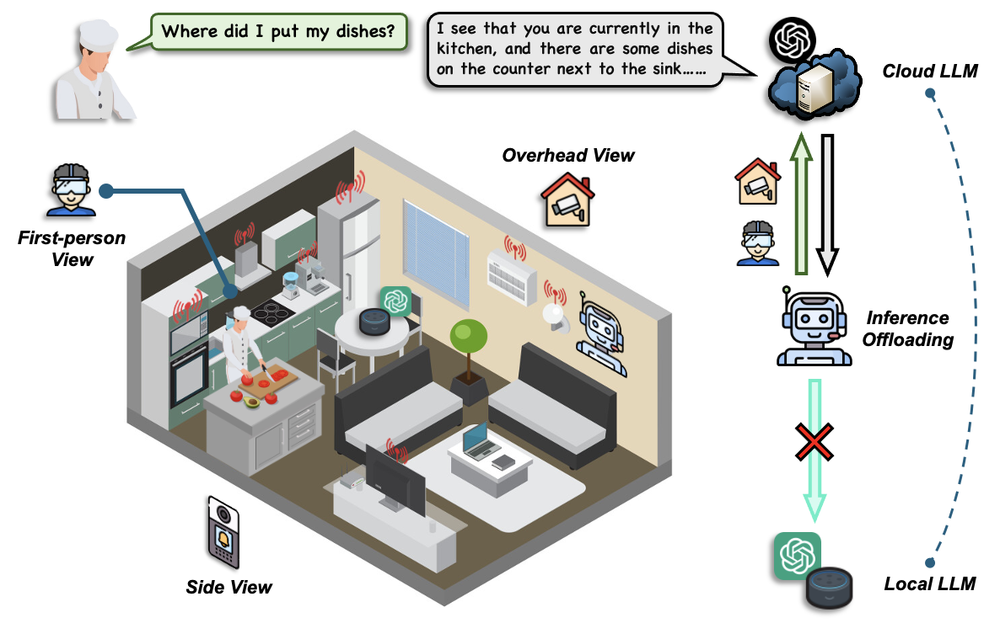
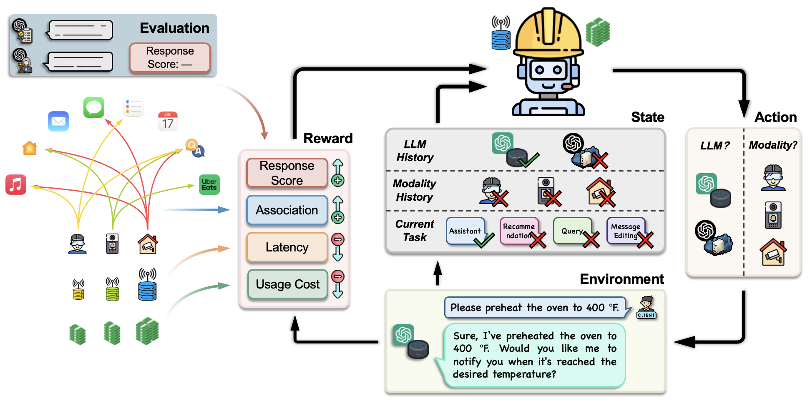
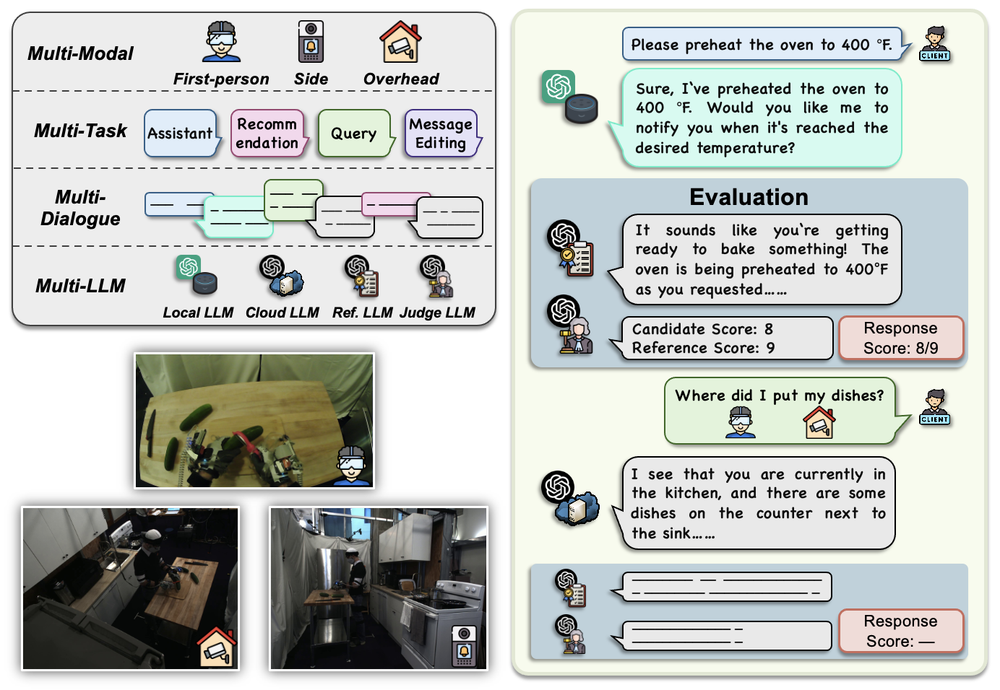

## Local-Cloud Inference Offloading for LLMs in Multi-Modal, Multi-Task, Multi-Dialogue Settings

[](https://www.python.org/downloads/release/python-31012/)
[](https://opensource.org/licenses/MIT) 
[](https://arxiv.org/abs/2502.11007)

[](#)

## 👨‍🍳 Use Case: Kitchen Activity Assistance with LLM

Imagine a scenario where an intelligent assistant helps you track activities in your kitchen:

- **User:** *Where did I put my dishes?*
- **RL Agent:** Processes first-person and overhead camera views -> Sends to Cloud LLM.
- **Cloud LLM:** *I see that you are in the kitchen. There are dishes on the counter next to the sink, likely just placed there after washing. Would you like me to turn on the dishwasher so you can put them away?*

<div align="center">
    
</div>


## 🔥 Our Framework

We present **TMO** (Three-M Offloading), a local-cloud LLM inference system designed to optimize **response quality**, **latency**, and **cost efficiency** for LLMs in **multi-modal, multi-task, and multi-dialogue settings**. TMO dynamically adapts to diverse conversational demands across tasks such as assistance, query, recommendation, and message editing. To enhance performance, we propose resource-constrained RL, which selects the best LLMs and modalities for inference, balancing quality, latency, and cost. RCRL also integrates user prompt associations with multi-modal data to effectively manage task connections in decision-making.

<div align="center">
    
</div>


## 🖥️ Prerequisites

Install the required packages via:
```bash
pip install -r requirements.txt
```

Alternatively, ensure the following dependencies are installed:
```plaintext
python == 3.10.12
numpy == 1.26.4
torch == 2.2.1
gymnasium == 0.28.1
stable_baselines3 == 2.2.1
scikit-learn == 1.5.1
```


## 📚 M4AI Dataset

We introduce **M4AI**, a comprehensive dataset capturing the **four multi-** elements **all in one** dataset:
1. **Multi-Modal:** Includes three different view images.
2. **Multi-Task:** Features four distinct tasks.
3. **Multi-Dialogue:** Contains sequences of 2–5 dialogues.
4. **Multi-LLM:** Incorporates four LLMs tailored for different purposes.

<div align="center">
    
</div>


## 🗂️ Folder Structure
```
TMO/
│   README.md
│   requirements.txt
│
├─── main/
│   │   main.py
│   │   models.py
│   │   utils.py
│   │   options.py 
│   └─── results/
│       │   Main_Results.pkl
│
├─── dataset/
│   │   M4A1.json
```

- **`main/`**: Contains the primary codebase.
  - `main.py`: Entry point of the system.
  - `models.py`: Includes model definitions such as `RC_PPO`, `RC_A2C`, and `RC_DQN`.
  - `utils.py`: Contains utility functions for tasks like data processing, env, and evaluation.
  - `options.py`: Manages command-line arguments and system configurations.
  - `results/`: Stores output files and results generated by the system.
- **`dataset/`**: Stores the M4AI dataset.


## 🏃‍♂ Run Code

Run the framework with the following command:
```bash
python main/main.py
```


## 🙏 Acknowledgement

The images in the M4A1 dataset are derived from the [ActionSense](https://action-sense.csail.mit.edu/) dataset.

